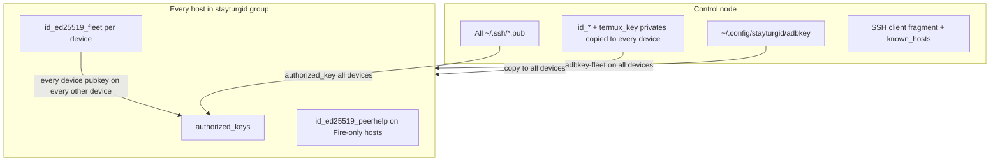

# Running stayturgid at another site

Analysis for operators who want Android devices managed from a **control node** that may
be macOS, Debian (stable/testing/unstable), or Ubuntu (latest LTS or current). This
site (djbclark’s fleet) uses **full mesh trust**: every device trusts every other device
plus the control node. A later section covers **trust groups** (sysadmin / bob / alice).

**Related docs:** [ansible_collections/docs/adoption.md](ansible_collections/docs/adoption.md),
[examples/consumer-termux-only/](examples/consumer-termux-only/),
[examples/consumer-full-fleet/](examples/consumer-full-fleet/),
[ansible/inventory/hosts.yml](ansible/inventory/hosts.yml) (site-file pattern).

---

## 1. Adoption tiers (pick one)

| Tier | Control node | Devices | Effort | What you get |
|------|--------------|---------|--------|--------------|
| **A — Termux only** | Any OS with SSH | 1+ | Low | Repair scripts, boot loop, sshd; no AutoJs6 fleet |
| **B — Ansible fleet** | Linux or macOS | 2+ | Medium | Full `site.yml` deploy; manual adb keepalive on Linux |
| **C — Reference parity** | **macOS today** | 3+ incl. Fire | High | launchd health, Handsets UI, VLM, Fire peer-help |

Tier **A** is Linux-friendly today via `examples/consumer-termux-only/`. Tier **C** matches
this repo’s production path (`HANDOFF.md`, `make health`, Handsets). Tier **B** is the
realistic target for Debian/Ubuntu after a modest port (see §5).

---

## 2. Minimal-effort checklist (new operator)

### 2.1 One-time control node

1. **Clone** the repo (fork if you will carry site-specific inventory on `master`).
2. **Install tools** (see §3 per OS).
3. **SSH identity for Termux:**
   ```bash
   ssh-keygen -t ed25519 -f ~/.ssh/termux_key -N ''
   ```
4. **Fleet ADB key** (one “Always allow” for peer ADB help):
   ```bash
   mkdir -p ~/.config/stayturgid
   adb keygen ~/.config/stayturgid/adbkey
   ```
5. **Site inventory** — copy and edit:
   - `ansible/inventory/hosts.yml` from
     [examples/consumer-full-fleet/inventory/hosts.yml.example](examples/consumer-full-fleet/inventory/hosts.yml.example)
     or trim the stock file.
   - Per host: `ansible_host` (Tailscale or LAN), `device_usb_serial`, `device_lan_ip`,
     taxonomy groups (`vendor_*`, `model_*`, `android_*`).
6. **Site group_vars** — edit [ansible/inventory/group_vars/stayturgid.yml](ansible/inventory/group_vars/stayturgid.yml):
   - `stayturgid_control_peer` (today named `stayturgid_mac_peer`): your control node’s
     Tailscale/LAN IP, SSH user, **absolute** path to `mac/fire_peer_help.py` in *your*
     checkout (only needed for Fire / `stayturgid_no_local_adb` hosts).
   - App-store flags (`stayturgid_app_stores_enabled`, etc.) — leave `false` unless you
     need Neo/Aurora.
7. **Galaxy collections:**
   ```bash
   ansible-galaxy collection install -r ansible/requirements.yml -p .ansible/collections
   ```
8. **macOS only:** `make deploy-mac` (Homebrew bootstrap, adb, launchd agents, optional VLM).
9. **Linux:** set `export STAYTURGID_ADB=/usr/bin/adb` (or `which adb`) in shell profile;
   deploy with `make deploy` only after §5 blockers are addressed, or use
   `--skip-tags mac` until then.

### 2.2 Each new Android device

1. **Hardware / OS prep** — Termux debug build, Termux:Boot, Shizuku (thedjchi fork),
   AutoJs6, Tailscale (recommended), wireless debugging — [HACKING.md](HACKING.md) Part 1.
2. **Add host** to `ansible/inventory/hosts.yml` + taxonomy groups.
3. **First SSH** (USB or wireless adb required once):
   ```bash
   make bootstrap-ssh HOSTS=<alias>
   # or: python3 mac/bootstrap_ssh.py <alias>
   ```
4. **Deploy:**
   ```bash
   make deploy HOSTS=<alias>
   ```
5. **One-time UI** on device if prompted: Shizuku start, AutoJs6 accessibility, Obtainium
   catalog import (post-ui playbooks).

### 2.3 Optional (reference site only)

| Item | When needed |
|------|-------------|
| Handsets `~/.handsets/{hs,hs.jar}` | Mac Handsets post-UI, Fire peer bootstrap |
| `make vlm-install` + `vlm-service-install` | Screenshot verification gates ([VLM.md](VLM.md)) |
| `play.env` + `obtain_play_aas.py` | Google Play / Aurora downloads |
| `pipx install uiautomator2` | Mac debug (Ansible installs on `deploy-mac`) |

---

## 3. Control-node OS matrix

### 3.1 macOS (Sequoia+ — reference)

| Concern | Status |
|---------|--------|
| Ansible deploy | Supported (`make deploy`, `mac-site.yml`) |
| Homebrew + adb | `mac-prereqs.yml` (`community.general.homebrew`) |
| Background keepalive | `community.general.launchd` agents (`com.stayturgid.*`) |
| VLM sidecar | `mac-vlm.yml` (llama.cpp + launchd) |
| Handsets UI driver | `~/.handsets/hs` (manual binary install) |
| Fire peer-help target | `stayturgid_mac_peer` + Remote Login + ForceCommand in `mac.yml` |

**Minimal path:** `make deploy-mac` then `make deploy`.

### 3.2 Debian / Ubuntu (stable, testing, unstable, LTS, current)

| Concern | Status today | Packages (typical) |
|---------|--------------|-------------------|
| Ansible / Python / git | Works | `ansible` or pipx `ansible-core`, `python3`, `git` |
| adb | Works if on PATH | `android-sdk-platform-tools` (Debian/Ubuntu) or Google zip |
| Device Ansible (`site.yml` device plays) | Works | SSH to Termux :8022 |
| `make test` / CI | Works | Ubuntu CI runs full unit suite |
| `mac-prereqs.yml` | Skipped (`end_host` when not Darwin) | — |
| `mac.yml` launchd | **Fails on Linux** | No equivalent shipped |
| `make health` / fleet monitors | Broken default adb path | Set `STAYTURGID_ADB` |
| VLM | Skipped on Linux playbooks | Manual `llama-server` possible (`vlm_gate.py`) |
| Handsets on control node | Mac binary | Use on-device post-UI over SSH, or peer-only path |
| Fire → control peer-help | Possible | Enable `openssh-server`, fix `help_cmd` path, run `mac.yml` ForceCommand tasks |

**Minimal path today (Tier B):**

```bash
sudo apt install ansible python3 python3-venv git android-sdk-platform-tools openssh-client
export STAYTURGID_ADB=/usr/bin/adb
ansible-galaxy collection install -r ansible/requirements.yml -p .ansible/collections
make bootstrap-ssh HOSTS=phone1
ANSIBLE_CONFIG=ansible/ansible.cfg ansible-playbook ansible/playbooks/site.yml --skip-tags mac
```

Cron/systemd for `python3 mac/adb_reconnect.py <alias>` is manual until §5.1 lands.

### 3.3 Cross-distro notes

| Topic | Guidance |
|-------|----------|
| **Python** | 3.12+ tested in CI; 3.14 on reference Mac |
| **Node** | Optional; only for JS unit tests |
| **Tailscale** | Strongly recommended; inventory uses stable `100.x` addresses |
| **LAN-only** | Supported: set `ansible_host` to LAN IP; drop Tailscale-specific watchdog features |
| **Multiple control laptops** | Not supported as first-class; see §6 trust groups |

---

## 4. Site-specific vs generic (what to change)

### 4.1 Must customize (per site)

| File / artifact | Content |
|-----------------|---------|
| `ansible/inventory/hosts.yml` | Host aliases, IPs, USB serials, taxonomy membership |
| `ansible/inventory/group_vars/stayturgid.yml` | Control peer, app-store flags, optional `stayturgid_mac_peer` |
| `~/.ssh/termux_key` | Operator → device SSH (never in git) |
| `~/.config/stayturgid/adbkey` | Fleet ADB identity (never in git) |
| `~/.config/stayturgid/play.env` | Play tokens if using Aurora/apkeep |

### 4.2 Hardcoded to reference site (fix or override)

| Location | Issue | Override |
|----------|-------|----------|
| `peers.json.j2` | `ssh_user: djbclark` for Termux peers | Should use `hostvars[h].ansible_user` (repo fix) |
| `termux/py/stayturgid_peer_bootstrap.py` | `DEFAULT_SSH_USER = "djbclark"` | Set `ansible_user` in inventory consistently |
| `stayturgid_mac_peer.help_cmd` | `/Users/djbclark/stayturgid/...` | Your clone path |
| `mac/adb_reconnect.py`, `access_monitor.py` | Default `/opt/homebrew/bin/adb` | `STAYTURGID_ADB` env |
| `play/mac/obtain_play_aas.py` | Default Gmail | `-e your@email` |
| Galaxy `repository:` URLs | `djbclark/stayturgid` | Fork URL in consumer `requirements.yml` |

### 4.3 Generic (do not fork)

- `ansible_collections/stayturgid/*` roles and modules
- Taxonomy `group_vars` (`vendor_amazon.yml`, `model_*`, etc.)
- Termux / AutoJs6 scripts, self-heal loops
- Playbook graph in `site.yml`

---

## 5. Work needed for Linux control-node parity

Ordered by impact for “minimal effort” on Debian/Ubuntu.

### 5.1 P0 — Unblock `make deploy` on Linux

| Task | Detail |
|------|--------|
| Guard `mac.yml` | `meta: end_host` when not Darwin (like `mac-prereqs.yml`), or split `control-node.yml` with `when:` per OS family |
| Fix adb defaults | Use `shutil.which("adb")` or honor `STAYTURGID_ADB` in **all** `mac/*.py` (today `adb_reconnect.py` / `access_monitor.py` ignore env) |
| Document `--skip-tags mac` | Until guard lands, consumer README for Linux |

### 5.2 P1 — Operator ergonomics without launchd

| Task | Detail |
|------|--------|
| `ansible/playbooks/linux-control.yml` | systemd user units or timers for adb-reconnect, fleet-health, access-monitor, fire-help (templates parallel to existing plists) |
| `make deploy-linux` | Apt install adb, ansible, scrcpy; enable systemd units |
| `configure` script | Detect systemd + `/usr/bin/adb`, not only Homebrew/launchd |
| `devices.conf` + SSH fragment on Linux | Render from `mac.yml` tasks that are OS-agnostic (split launchd out) |

### 5.3 P2 — Feature parity gaps

| Task | Detail |
|------|--------|
| Handsets on Linux | Investigate Linux build of `hs`, or document on-device-only UI path |
| VLM on Linux | `apt`/manual `llama.cpp` + systemd unit (mirror `mac-vlm.yml` with `ansible.builtin.service`) |
| fdroidcl/apkeep PATH | Extend `fdroidcl_install.py` PATH for `/usr/bin` |
| Control-node sshd for Fire | Document `openssh-server` + firewall; `mac.yml` ForceCommand is OS-neutral but lives in “mac” playbook |
| Consumer example | `examples/consumer-linux-control/` with inventory + skip-mac playbook |

### 5.4 P3 — Polish

| Task | Detail |
|------|--------|
| Remove `djbclark` defaults | Template `ansible_user` through peers JSON and peer bootstrap |
| Notifications | Replace `osascript` with `notify-send` / email when not Darwin |
| Multi-arch Homebrew prefix | Already in `vars/mac.yml`; Linux uses distro packages instead |

---

## 6. Trust model today (full mesh)



**Layers:**

1. **Operator → device:** Every `*.pub` under `stayturgid_ssh_keys_dir` (default
   `~/.ssh`) installed on every device
   ([ssh_keys.yml](ansible_collections/stayturgid/termux/roles/termux_userland/tasks/ssh_keys.yml)).
2. **Device → device:** Per-host `id_ed25519_fleet` pubkey installed on all peers in
   `groups[stayturgid_ssh_mesh_group]` (default `stayturgid`).
3. **Private keys on devices:** All control-node private keys (`id_*`, `termux_key`)
   copied to **every** device when `stayturgid_ssh_distribute_private_keys: true` —
   so any device can SSH as the operator to any peer.
4. **known_hosts:** Full mesh of sshd host keys (inventory name, Tailscale IP, LAN IP).
5. **ADB:** Single shared `adbkey-fleet` on all devices for peer ADB help.
6. **Fire peer-help:** Restricted **second** channel — Fire’s `id_ed25519_peerhelp` may
   only run `stayturgid-peer-help-force.sh` on helpers (and `fire_peer_help.py` on
   control node via ForceCommand). This is *not* general shell access.
7. **peers.json:** Lists all fleet peers + control node for Handsets/Shizuku bootstrap.

**Implication:** Any compromised device with Termux home readable gets keys that can SSH
to all siblings as the operator. Acceptable for a single-owner fleet; not for delegated
users.

---

## 7. Trust groups (future): sysadmin, bob, alice

### 7.1 Desired policy (example)

| Actor | SSH access | ADB / deploy | Notes |
|-------|------------|--------------|-------|
| **Control node (sysadmin)** | All devices | `ansible-playbook` full fleet | CI or laptop |
| **sysadmin devices** | All devices | Same as today’s mesh | “Break glass” phones |
| **bob** | bob’s devices only | `--limit bob_devices` | Cannot SSH to alice |
| **alice** | alice’s devices only | `--limit alice_devices` | Cannot SSH to bob |

Everyone trusts the **control node** for configuration. **sysadmin** tier trusts
everything; **bob** and **alice** are isolated from each other’s devices.

### 7.2 Gap analysis (what must change)

| Component | Today | Trust-group change |
|-----------|-------|-------------------|
| **Inventory** | Flat `stayturgid` group | Add `trust_group` host var and/or child groups: `trust_sysadmin`, `trust_bob`, `trust_alice`; hosts may be in one user group |
| **`ssh_keys.yml` mesh loop** | `loop: "{{ groups['stayturgid'] }}"` | Loop only peers in **trust closure** of host (e.g. bob + sysadmin + control, not alice) |
| **Control node pub keys** | All `*.pub` → all devices | Map keys to groups: sysadmin keys everywhere; `bob_key.pub` only on bob + sysadmin hosts |
| **Private key distribution** | All privates → all devices | **Stop** distributing operator privates to devices except sysadmin break-glass; devices only need their own `id_ed25519_fleet` + maybe one peer-help key |
| **`stayturgid_ssh_mesh_group`** | Single group name | Per-host computed group or Jinja filter `trust_peers(host)` |
| **`known_hosts_mesh.j2`** | All peers | Same trust closure filter |
| **`peers.json.j2`** | All peers + mac | Filter `can_help` peers by trust; bob’s Fire must not list alice helpers unless shared sysadmin pool |
| **`peerhelp-force.yml`** | Fire keys on all helpers | Only install Fire pubkey on helpers in same trust group (or sysadmin pool) |
| **`stayturgid_mac_peer`** | One control peer | Renamed `stayturgid_control_peer`; optional list if multiple bastions |
| **`devices.conf`** | All hosts | Operator-specific render or single file with ACL in scripts |
| **Fleet ADB key** | One global `adbkey` | Per trust group (`adbkey-bob`, `adbkey-alice`) or per-device pairing |
| **Ansible RBAC** | None | Convention: bob runs with `--limit trust_bob`; separate `termux_key` per operator |
| **Tailscale ACLs** | Open tailnet | Optional network-layer mirror: tags `tag:bob`, `tag:alice` |
| **`authorized_key` `exclusive`** | `false` (additive) | May need `exclusive: true` per key class + careful ordering, or separate `authorized_keys.d/` |

### 7.3 Proposed inventory shape (sketch)

```yaml
all:
  children:
    stayturgid:
      children:
        trust_sysadmin:
          hosts: { s24: {}, hd8: {} }
        trust_bob:
          hosts: { bob-phone-1: {} }
        trust_alice:
          hosts: { alice-phone-1: {} }
      vars:
        stayturgid_trust_model: grouped   # future; default full_mesh for back compat
```

Host vars:

```yaml
bob-phone-1:
  stayturgid_trust_groups: [bob]          # membership
  ansible_user: bob                       # Termux account name if per-user Termux
```

Control-node keys in `group_vars`:

```yaml
stayturgid_operator_keys:
  sysadmin:
    - "{{ lookup('file', '~/.ssh/termux_key.pub') }}"
  bob:
    - "{{ lookup('file', '~/.ssh/bob_termux.pub') }}"
```

### 7.4 Implementation phases

| Phase | Scope | Backward compatible? |
|-------|-------|----------------------|
| **0** | Document `--limit` + separate inventories per user (no code) | Yes |
| **1** | Add `stayturgid_trust_peers` Jinja helper; filter mesh loops when `stayturgid_trust_model: grouped` | Yes (`full_mesh` default) |
| **2** | Per-operator `termux_key`; stop copying all privates to all devices | Breaking for scripts that SSH device→device as operator |
| **3** | Trust-aware `peers.json`, peer-help, ADB keys | Breaking for cross-group Fire help |
| **4** | Multi-control-node docs + optional Tailscale ACL templates | Additive |

### 7.5 What stays “full trust” even with groups

- **sysadmin** control node and sysadmin-tagged devices should behave like today.
- **Termux self-heal** on device is local; no change.
- **Obtainium / app stores** remain fleet-wide vars unless split by group_vars hierarchy.

### 7.6 Non-goals (trust groups)

- Per-user Termux **accounts** on one physical phone (one `u0_aXXX` per install).
- Android multi-user profiles as security boundaries.
- Replacing Tailscale with stayturgid SSH alone.

---

## 8. Recommended paths by site shape

### Single owner, mixed phones (like this site)

- **Control:** macOS, `make deploy` + `make health`.
- **Inventory:** one `stayturgid` group, full mesh.
- **Fire device:** keep `stayturgid_mac_peer` / control peer + peer-help plays.

### Small team, shared fleet, no Fire

- **Control:** Linux or macOS Tier B.
- **Trust:** Phase 0 — separate `termux_key` per operator, Ansible `--limit` per device
  subset; accept full mesh until Phase 1 lands.
- **Skip:** VLM, Handsets on control node if post-UI runs on-device over SSH.

### Multi-tenant (bob + alice)

- **Do not** use production mesh today without Phase 1–3.
- **Interim:** separate forks/inventories per tenant, or separate Tailscale tailnets.
- **Target:** §7 trust-group variables + filtered `authorized_key` loops.

---

## 9. Quick reference commands

```bash
# Probe tools
./configure

# macOS control-node setup
make deploy-mac

# Full fleet (macOS)
make deploy

# Full fleet (Linux interim)
export STAYTURGID_ADB=/usr/bin/adb
ansible-playbook ansible/playbooks/site.yml --skip-tags mac

# One device bootstrap + deploy
make bootstrap-ssh HOSTS=myphone
make deploy HOSTS=myphone

# Termux-only consumer
cd examples/consumer-termux-only && ansible-playbook playbook.yml
```

---

## 10. Summary

| Question | Answer |
|----------|--------|
| **Minimal effort today?** | Termux-only consumer, or macOS full fleet with customized `hosts.yml` + keys |
| **Linux control node?** | Device Ansible works; control-plane daemons and `mac.yml` need port (§5) |
| **What must every site edit?** | `hosts.yml`, control peer vars, `termux_key`, optional `adbkey` |
| **Trust groups?** | Not implemented; full mesh is implicit; §7 lists required Ansible/inventory work |
| **Examples** | `examples/consumer-{termux-only,fdroid-only,full-fleet}/` |

For a tracked implementation epic, split §5 (Linux control node) and §7 (trust groups)
into separate ADRs or GitHub issues — they are independent efforts.
