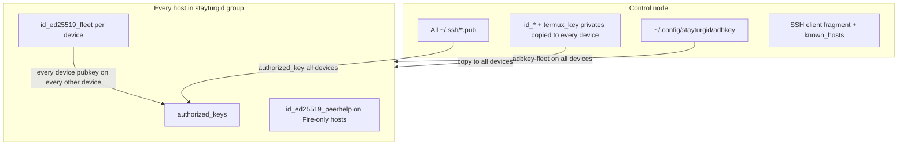

# Running stayturgid at another site

Analysis for operators who want Android devices managed from a **control node** that may
be macOS, Debian (stable/testing/unstable), or Ubuntu (latest LTS or current). This
site (the operator’s production fleet) uses **full mesh trust**: every device trusts
every other device plus the control node. A later section covers **trust groups**
(sysadmin / bob / alice).

The **upstream repo should not embed that production fleet** — see §4 for moving
real hostnames, IPs, and operator paths into a separate GitHub project, and for
platform-describing example hostnames in the main tree.

The implementation-ready source-of-truth architecture and migration sequence are in
[docs/research/site-identity-source-of-truth-2026-07-14.md](../research/site-identity-source-of-truth-2026-07-14.md).

**Related docs:** [ansible_collections/adoption.md](../ansible/collections/adoption.md),
[examples/consumer-termux-only/](../../examples/consumer-termux-only),
[examples/consumer-full-fleet/](../../examples/consumer-full-fleet).

---

## 1. Adoption tiers (pick one)

| Tier                     | Control node    | Devices       | Effort | What you get                                          |
| ------------------------ | --------------- | ------------- | ------ | ----------------------------------------------------- |
| **A — Termux only**      | Any OS with SSH | 1+            | Low    | Repair scripts, boot loop, sshd; no AutoJs6 fleet     |
| **B — Ansible fleet**    | Linux or macOS  | 2+            | Medium | Full `site.yml` deploy; manual adb keepalive on Linux |
| **C — Reference parity** | **macOS today** | 3+ incl. Fire | High   | launchd health, Handsets UI, VLM, Fire peer-help      |

Tier **A** is Linux-friendly today via `examples/consumer-termux-only/`. Tier **C** matches
this repo’s production path (`docs/handoff.md`, `just health`, Handsets). Tier **B** is the
realistic target for Debian/Ubuntu after a modest port (see §6).

---

## 2. Minimal-effort checklist (new operator)

### 2.1 One-time control node

1. **Clone** the generic upstream repo; create a **site overlay** repo (§4) for inventory.
2. **Install tools** (see §3 per OS).
3. **SSH identity for Termux:**
   ```bash
   ssh-keygen -t ed25519 -f ~/.ssh/termux_key -N ''
   ```
4. **Fleet ADB key** (one “Always allow” for peer ADB help):
   ```bash
   mkdir -p ~/.config/stayturgid
   adb keygen ~/.config/stayturgid/adbkey
   ```
5. **Site inventory** — in your site repo only (§4). Upstream will ship
   `ansible/inventory/hosts.yml.example` with platform example hostnames, not real IPs.
6. **Site group_vars** — in your site repo (`stayturgid_control_peer`, app-store flags).
7. **Galaxy collections:**
   ```bash
   ansible-galaxy collection install -r ansible/requirements.yml -p .ansible/collections
   ```
8. **macOS only:** `just deploy-mac` (Homebrew bootstrap, adb, launchd agents, optional VLM).
9. **Linux:** set `export STAYTURGID_ADB=/usr/bin/adb` (or `which adb`) in shell profile;
   deploy with `just deploy` only after §5 blockers are addressed, or use
   `--skip-tags mac` until then.

### 2.2 Each new Android device

1. **Hardware / OS prep** — Termux debug build, Termux:Boot, Shizuku (thedjchi fork),
   AutoJs6, Tailscale (recommended), wireless debugging — [docs/hacking.md](../hacking.md) Part 1.
2. **Add host** to your site repo’s `inventory/hosts.yml` + taxonomy groups.
3. **First SSH** (USB or wireless adb required once):
   ```bash
   just bootstrap-ssh HOSTS=<alias>
   # or: python3 control/bin/bootstrap_ssh.py <alias>
   ```
4. **Deploy:**
   ```bash
   just deploy hosts=<alias>
   ```
5. **One-time UI** on device if prompted: Shizuku start, AutoJs6 accessibility, Obtainium
   catalog import (post-ui playbooks).

### 2.3 Optional (reference site only)

| Item                                       | When needed                                                        |
| ------------------------------------------ | ------------------------------------------------------------------ |
| Handsets `~/.handsets/{hs,hs.jar}`         | Mac Handsets post-UI, Fire peer bootstrap                          |
| `just vlm-install` + `vlm-service-install` | Screenshot verification gates ([docs/architecture/vlm.md](vlm.md)) |
| `play.env` + `obtain_play_aas.py`          | Google Play / Aurora downloads                                     |
| `uv tool install uiautomator2`             | Mac debug (Ansible installs on `deploy-mac`)                       |

---

## 3. Control-node OS matrix

### 3.1 macOS (Sequoia+ — reference)

| Concern               | Status                                                                       |
| --------------------- | ---------------------------------------------------------------------------- |
| Ansible deploy        | Supported (`just deploy`, `control_node/site.yml`)                           |
| Homebrew + adb        | `control_node/prereqs.yml` (`community.general.homebrew`)                    |
| Background keepalive  | `community.general.launchd` agents (`com.stayturgid.*`)                      |
| VLM sidecar           | `control_node/vlm.yml` (llama.cpp + launchd)                                 |
| Handsets UI driver    | `~/.handsets/hs` (manual binary install)                                     |
| Fire peer-help target | `stayturgid_mac_peer` + Remote Login + ForceCommand in `control_node/agents` |

**Minimal path:** `just deploy-mac` then `just deploy`.

### 3.2 Debian / Ubuntu (stable, testing, unstable, LTS, current)

| Concern                                  | Status today                         | Packages (typical)                                                                         |
| ---------------------------------------- | ------------------------------------ | ------------------------------------------------------------------------------------------ |
| Ansible / Python / git                   | Works                                | `ansible` or `uv tool install ansible-core`, `python3`, `git`                              |
| adb                                      | Works if on PATH                     | `android-sdk-platform-tools` (Debian/Ubuntu) or Google zip                                 |
| Device Ansible (`site.yml` device plays) | Works                                | SSH to Termux :8022                                                                        |
| `just test` / CI                         | Works                                | Ubuntu CI runs full unit suite                                                             |
| `control_node/prereqs.yml`               | Skipped (`end_host` when not Darwin) | —                                                                                          |
| `control_node/agents` launchd            | **Fails on Linux**                   | No equivalent shipped                                                                      |
| `just health` / fleet monitors           | Broken default adb path              | Set `STAYTURGID_ADB`                                                                       |
| VLM                                      | Skipped on Linux playbooks           | Manual `llama-server` possible (`vlm_gate.py`)                                             |
| Handsets on control node                 | Mac binary                           | Use on-device post-UI over SSH, or peer-only path                                          |
| Fire → control peer-help                 | Possible                             | Enable `openssh-server`, fix `help_cmd` path, run `control_node/agents` ForceCommand tasks |

**Minimal path today (Tier B):**

```bash
sudo apt install ansible python3 python3-venv git android-sdk-platform-tools openssh-client
export STAYTURGID_ADB=/usr/bin/adb
ansible-galaxy collection install -r ansible/requirements.yml -p .ansible/collections
just bootstrap-ssh hosts=phone1
ANSIBLE_CONFIG=ansible/ansible.cfg ansible-playbook ansible/playbooks/site.yml --skip-tags mac
```

Cron/systemd for `python3 control/bin/adb_reconnect.py <alias>` is manual until §6.1 lands.

### 3.3 Cross-distro notes

| Topic                        | Guidance                                                                           |
| ---------------------------- | ---------------------------------------------------------------------------------- |
| **Python**                   | 3.12+ tested in CI; 3.14 on reference Mac                                          |
| **Node**                     | Optional; only for JS unit tests                                                   |
| **Tailscale**                | Strongly recommended; inventory uses stable `100.x` addresses                      |
| **LAN-only**                 | Supported: set `ansible_host` to LAN IP; drop Tailscale-specific watchdog features |
| **Multiple control laptops** | Not supported as first-class; see §7 trust groups                                  |

---

## 4. Generic upstream vs site overlay repository

> **Status update (2026-07-18):** the reference site overlay repo now exists —
> private `site-djbclark` — and Phase 0 is effectively complete. The base-dir
> convention is a plain `~/ops` directory holding sibling checkouts
> (`~/ops/stayturgid`, `~/ops/site-<operator>`); a site repo must never be
> nested inside a public working tree. Topology rationale and the serverapp
> adapter model live in the site repo's step1 architecture doc and
> [ADR 005](adr/005-two-repo-topology.md).

Upstream used to embed **operator production data** (short site aliases such as
`s24` / `p7a` / `hd8`, real Tailscale/LAN addresses, operator usernames, absolute
home paths). That made forks and docs harder than they need to be. The target
shape is **two GitHub projects**:

| Repo                                       | Role                                                                                    | Visibility |
| ------------------------------------------ | --------------------------------------------------------------------------------------- | ---------- |
| **`stayturgid`** (upstream)                | Platform code, collections, playbooks, tests, **generic** example inventory             | Public     |
| **`stayturgid-site-<operator>`** (overlay) | Real hostnames, IPs, USB serials, control-peer paths, `docs/handoff.md`-style ops notes | Private    |

Consumers clone upstream, then point Ansible at their overlay inventory (submodule, sibling
checkout, or `ANSIBLE_CONFIG` + custom `inventory/`).

### 4.1 Platform-describing example hostnames

Upstream docs, tests, and example inventory should use names that describe **what the
device is for in the test matrix**, not who owns it:

| Example hostname       | Replaces (today) | Platform / role                                                        |
| ---------------------- | ---------------- | ---------------------------------------------------------------------- |
| `oneui-device`         | `s24`            | Samsung One UI (e.g. Galaxy class), Android 16, local ADB + Termux SSH |
| `stock-android-device` | `p7a`            | Stock Android / Pixel class, Android 16, helper for Fire peer paths    |
| `fireos-device`        | `hd8`            | Fire OS / Amazon, `stayturgid_no_local_adb`, peer-help consumer        |

Use **placeholder** addresses in upstream only:

- `ansible_host: 100.0.0.11` (example Tailscale)
- `device_lan_ip: 192.0.2.11` (TEST-NET-1, RFC 5737)
- `device_usb_serial: EXAMPLE-SERIAL-ONEUI`
- `ansible_user: termux` (not a real login name)

Taxonomy groups stay generic (`vendor_samsung`, `oneui_7`, `model_galaxy_s24`, etc.) —
they describe hardware/OS families, not site ownership.

### 4.2 What moves out of upstream → site repo

| Artifact                                                                        | Site repo path (suggested)                                    |
| ------------------------------------------------------------------------------- | ------------------------------------------------------------- |
| Production `ansible/inventory/hosts.yml`                                        | `inventory/hosts.yml`                                         |
| `ansible/inventory/group_vars/stayturgid.yml` (real `stayturgid_mac_peer`, IPs) | `inventory/group_vars/stayturgid.yml`                         |
| Operator session docs                                                           | `docs/handoff.md`, `human/*` (or drop from upstream entirely) |
| Live device notes (Tailscale names, DHCP anecdotes)                             | Site `docs/handoff.md` only                                   |
| `play.env`, secrets                                                             | Never in git; site repo may have `play.env.example`           |
| Makefile convenience defaults (`HOSTS=s24`)                                     | Root `justfile` or recipe groups                              |

### 4.3 What stays in upstream (generic)

| Artifact                                                                          | Notes                                                                            |
| --------------------------------------------------------------------------------- | -------------------------------------------------------------------------------- |
| `ansible/inventory/hosts.yml.example`                                             | Three example hosts (`oneui-device`, …) with RFC 5737 IPs                        |
| `ansible/inventory/group_vars/*.yml` except site peer                             | Taxonomy quirks (Fire, One UI, Pixel)                                            |
| `ansible_collections/`, `ansible/playbooks/`, `device/termux/`, `device/autojs6/` | Product code                                                                     |
| Unit tests                                                                        | Use example hostnames + `192.0.2.0/24` / `100.0.0.0/24` fixtures                 |
| `docs/hacking.md`                                                                 | Generic setup; link to docs/architecture/multi-site-topology.md for site overlay |
| `examples/consumer-*`                                                             | Already partially generic; align hostnames with §4.1                             |

### 4.4 Example upstream inventory (after split)

```yaml
# ansible/inventory/hosts.yml.example — committed in stayturgid (not live inventory)
all:
  children:
    stayturgid:
      hosts:
        oneui-device:
          ansible_host: 100.0.0.11
          device_usb_serial: EXAMPLE-SERIAL-ONEUI
          device_lan_ip: 192.0.2.11
          device_label: Example One UI phone
        stock-android-device:
          ansible_host: 100.0.0.12
          device_usb_serial: EXAMPLE-SERIAL-STOCK
          device_lan_ip: 192.0.2.12
          device_label: Example stock Android phone
        fireos-device:
          ansible_host: 100.0.0.13
          device_usb_serial: EXAMPLE-SERIAL-FIRE
          device_lan_ip: 192.0.2.13
          device_label: Example Fire OS tablet
      vars:
        ansible_port: 8022
        ansible_user: termux
        ansible_python_interpreter: /data/data/com.termux/files/usr/bin/python
        ansible_ssh_private_key_file: "{{ lookup('env', 'HOME') }}/.ssh/termux_key"
        stayturgid_device_id: "{{ inventory_hostname }}"
        stayturgid_automation_mode: autojs6
    android_16:
      hosts: { oneui-device: {}, stock-android-device: {} }
    android_11:
      hosts: { fireos-device: {} }
    vendor_samsung:
      hosts: { oneui-device: {} }
    vendor_google:
      hosts: { stock-android-device: {} }
    vendor_amazon:
      hosts: { fireos-device: {} }
    oneui_7:
      hosts: { oneui-device: {} }
    model_galaxy_s24:
      hosts: { oneui-device: {} }
    model_pixel_7a:
      hosts: { stock-android-device: {} }
    model_kindle_hd8:
      hosts: { fireos-device: {} }
```

Live deploys **do not** use this file — copy to the site repo and replace placeholders.

### 4.5 Example site overlay repo layout

```
stayturgid-site-acme/
  README.md                 # clone paths, just deploy wrapper
  ansible.cfg               # inventory = inventory/hosts.yml; collections_path → ../stayturgid/...
  inventory/
    hosts.yml               # real aliases (may keep s24 or rename), real 100.x / LAN IPs
    group_vars/
      stayturgid.yml        # stayturgid_control_peer, app-store flags
  docs/handoff.md                # operator + agent session context
  justfile + just/              # STAYTURGID_ROOT=../stayturgid just -d '' deploy ...
```

**Wire overlay to upstream:**

```bash
export STAYTURGID_ROOT=~/src/stayturgid
export ANSIBLE_CONFIG=$PWD/ansible.cfg   # site repo cfg → inventory here, playbooks in upstream
ansible-playbook "$STAYTURGID_ROOT/ansible/playbooks/site.yml"
# or: just -d "$STAYTURGID_ROOT" deploy hosts=oneui-device \
#       ANSIBLE_CONFIG=$PWD/ansible.cfg
```

`ansible.cfg` in the site repo sets `inventory` to the site tree and `collections_path` to
the upstream checkout (or installed collections).

### 4.6 Documentation and code scrub (upstream)

Replace site-specific hostnames in **user-facing generic docs** with §4.1 names. Keep
historical operator docs only in the site repo.

| Area                                                            | Action                                                                                       |
| --------------------------------------------------------------- | -------------------------------------------------------------------------------------------- |
| `ansible/README.md`, `docs/hacking.md`, `control/bin/README.md` | `oneui-device` / `stock-android-device` / `fireos-device`; no real IPs                       |
| `docs/handoff.md`, `human/*`                                    | **Move** to site repo; upstream stub points to docs/architecture/multi-site-topology.md      |
| `README.md`                                                     | Link docs/architecture/multi-site-topology.md + example inventory; remove fleet-specific IPs |
| Tests (`tests/python/*`)                                        | Fixture `devices.conf` lines use example hostnames + `192.0.2.x`                             |
| `control/lib/a11y_profiles.json`                                | Keys → example hostnames (or host-agnostic IDs)                                              |
| `peers.json.j2`, `stayturgid_peer_bootstrap.py`                 | Remove `djbclark`; use `ansible_user` from inventory                                         |
| `galaxy.yml` `repository:`                                      | Upstream org URL (not operator home)                                                         |
| `version.json` changelog                                        | Generic; site ops notes in site repo                                                         |
| Scripts default `HOSTS=hd8`                                     | `HOSTS=fireos-device` or require explicit `HOSTS`                                            |

**Do not scrub** research docs that record a specific historical debugging session unless
you move them to the site repo — or add a banner: “example names: see §4.1”.

### 4.7 Upstream `ansible.cfg` change

Stop defaulting `inventory = inventory/hosts.yml` to production data. Options:

1. **`inventory/hosts.yml.example` only** in upstream; `ansible.cfg` documents that
   operators must copy or set `ANSIBLE_CONFIG` from site repo.
2. **CI** copies `hosts.yml.example` → `hosts.yml` before syntax-check (ephemeral).

### 4.8 Implementation phases (repo split) and configuration precedence

Product entry points (`deploy_fleet.py`, `deploy_termux.py`, `verify_drift.py`,
`ansible_exec.py`, `validate_site_identity.py`) resolve their Ansible
configuration via `control/lib/ansible_context.py` in this order:

1. **`ANSIBLE_CONFIG`** — explicit, always wins. Errors it produces (missing
   file, missing inventory) are fatal; they never downgrade to a fallback.
2. **`STAYTURGID_SITE_DIR`** — explicit overlay directory; its `ansible.cfg`
   must exist or resolution fails.
3. **Discovery** — `OPS_ROOT` (default `~/ops`) is scanned for `site-*`
   checkouts containing an `ansible.cfg`. Exactly one match is used; zero or
   multiple matches fail with instructions to set `STAYTURGID_SITE_DIR` or
   `ANSIBLE_CONFIG`. There is **no operator-specific default directory** —
   the public product never hardcodes a site checkout name.

Identity validation additionally falls back to the committed
`hosts.yml.example` when resolution fails _without_ an explicit
`ANSIBLE_CONFIG` (the genuinely-unconfigured fresh-clone/CI case). Deploy and
verify entry points also refuse to run when the resolved inventory matches
zero hosts for the requested limit, naming the config file that was used.

| Phase | Work                                                                                                |
| ----- | --------------------------------------------------------------------------------------------------- |
| **0** | This doc + `hosts.yml.example` with generic names (can land before site repo exists)                |
| **1** | Create private `stayturgid-site-*` repo; move live `hosts.yml`, `stayturgid.yml`, `docs/handoff.md` |
| **2** | Scrub upstream docs/tests per §4.6; fix `djbclark` defaults in templates                            |
| **3** | `deploy_fleet.py` / `Makefile` accept `ANSIBLE_CONFIG` + external inventory                         |
| **4** | Consumer `examples/consumer-full-fleet` uses §4.1 hostnames; documents overlay pattern              |

### 4.9 Per-site customization (until split is complete)

Until Phase 1–2 ship, new operators still edit a forked `hosts.yml` in-tree:

| File / artifact                                    | Content                                             |
| -------------------------------------------------- | --------------------------------------------------- |
| Site inventory                                     | Host aliases, IPs, USB serials, taxonomy membership |
| Site `group_vars/stayturgid.yml`                   | Control peer, app-store flags                       |
| `~/.ssh/termux_key`, `~/.config/stayturgid/adbkey` | Secrets (never in git)                              |

**Upstream code still to genericize** (fix in main repo, not site overlay):

| Location                                        | Issue                                                  |
| ----------------------------------------------- | ------------------------------------------------------ |
| `peers.json.j2`                                 | Hardcoded `ssh_user: djbclark`                         |
| `device/termux/py/stayturgid_peer_bootstrap.py` | `DEFAULT_SSH_USER = "djbclark"`                        |
| `control/bin/*.py` adb path                     | Default `/opt/homebrew/bin/adb` — use `STAYTURGID_ADB` |
| `control/tools/play/obtain_play_aas.py`         | Default operator email                                 |

**Generic (do not fork):** collections, taxonomy `group_vars`, Termux/AutoJs6 scripts,
`site.yml` playbook graph.

### 4.10 The third repo: `~/ops/site-private`

Every operator running this stack has **three** sibling checkouts under
`~/ops/`, not two:

| Repo                 | Visibility                         | Purpose                                                                               |
| -------------------- | ---------------------------------- | ------------------------------------------------------------------------------------- |
| `~/ops/stayturgid`   | Always public                      | This repo — code, fleet conventions, durable rules, session history                   |
| `~/ops/site-<name>`  | Operator's choice (public/private) | One operator's live site overlay (§4 above)                                           |
| `~/ops/site-private` | **Always private**                 | Anything not managed by either of the above — canonical name, same for every operator |

**`~/ops/site-private` is the canonical policy home** for what belongs where
across all three repos, and for how Claude Code's cross-session memory system
is backed on a given machine (its live memory directory symlinks into
`site-private/memory/`). Read that repo's `README.md` for the full policy —
it is not duplicated here. In short: durable stayturgid-specific lessons
belong in this repo (see
[docs/notes/lessons-learned.md](../notes/lessons-learned.md)); site-specific
facts belong in `~/ops/site-<name>`; everything else belongs in
`~/ops/site-private`.

---

## 5. Work needed for Linux control-node parity

Ordered by impact for “minimal effort” on Debian/Ubuntu.

### 5.1 P0 — Unblock `just deploy` on Linux

| Task                        | Detail                                                                                                                                        |
| --------------------------- | --------------------------------------------------------------------------------------------------------------------------------------------- |
| Guard `control_node/agents` | `meta: end_host` when not Darwin (like `control_node/prereqs.yml`), or split OS-specific tasks                                                |
| Fix adb defaults            | Use `shutil.which("adb")` or honor `STAYTURGID_ADB` in **all** `control/bin/*.py` (today `adb_reconnect.py` / `access_monitor.py` ignore env) |
| Document `--skip-tags mac`  | Until guard lands, consumer README for Linux                                                                                                  |

### 5.2 P1 — Operator ergonomics without launchd

| Task                                   | Detail                                                                                                                          |
| -------------------------------------- | ------------------------------------------------------------------------------------------------------------------------------- |
| `ansible/playbooks/linux-control.yml`  | systemd user units or timers for adb-reconnect, fleet-health, access-monitor, fire-help (templates parallel to existing plists) |
| `just deploy`                          | Apt install adb, ansible, scrcpy, just; enable systemd units                                                                    |
| `configure` script                     | Detect systemd + `/usr/bin/adb`, not only Homebrew/launchd                                                                      |
| `devices.conf` + SSH fragment on Linux | Render from `control_node/agents` tasks that are OS-agnostic (split launchd out)                                                |

### 5.3 P2 — Feature parity gaps

| Task                       | Detail                                                                                                 |
| -------------------------- | ------------------------------------------------------------------------------------------------------ |
| Handsets on Linux          | Investigate Linux build of `hs`, or document on-device-only UI path                                    |
| VLM on Linux               | `apt`/manual `llama.cpp` + systemd unit (mirror `control_node/vlm.yml` with `ansible.builtin.service`) |
| fdroidcl/apkeep PATH       | Extend `fdroidcl_install.py` PATH for `/usr/bin`                                                       |
| Control-node sshd for Fire | Document `openssh-server` + firewall; `control_node/agents` ForceCommand is OS-neutral                 |
| Consumer example           | `examples/consumer-linux-control/` with inventory + skip-mac playbook                                  |

### 5.4 P3 — Polish

| Task                       | Detail                                                                                |
| -------------------------- | ------------------------------------------------------------------------------------- |
| Remove `djbclark` defaults | Template `ansible_user` through peers JSON and peer bootstrap                         |
| Notifications              | Replace `osascript` with `notify-send` / email when not Darwin                        |
| Multi-arch Homebrew prefix | Already in `roles/control_node/defaults/main.yml`; Linux uses distro packages instead |

---

## 6. Trust model today (full mesh)



**Layers:**

1. **Operator → device:** Every `*.pub` under `stayturgid_ssh_keys_dir` (default
   `~/.ssh`) installed on every device
   ([ssh_keys.yml](../../ansible_collections/stayturgid/termux/roles/termux_userland/tasks/ssh_keys.yml)).
2. **Device → device:** Per-host `id_ed25519_fleet` pubkey installed on all peers in
   `groups[stayturgid_ssh_mesh_group]` (default `stayturgid`).
3. **Private keys on devices:** All control-node private keys (`id_*`, `termux_key`)
   copied to **every** device when `stayturgid_ssh_distribute_private_keys: true` —
   so any device can SSH as the operator to any peer.
4. **known_hosts:** Full mesh of sshd host keys (inventory name, Tailscale IP, LAN IP).
5. **ADB:** Single shared `adbkey-fleet` on all devices for peer ADB help.
6. **Fire peer-help:** Restricted **second** channel — Fire’s `id_ed25519_peerhelp` may
   only run `stayturgid-peer-help-force.sh` on helpers (and `fire_peer_help.py` on
   control node via ForceCommand). This is _not_ general shell access.
7. **peers.json:** Lists all fleet peers + control node for Handsets/Shizuku bootstrap.

**Implication:** Any compromised device with Termux home readable gets keys that can SSH
to all siblings as the operator. Acceptable for a single-owner fleet; not for delegated
users.

---

## 7. Trust groups (future): sysadmin, bob, alice

### 7.1 Desired policy (example)

| Actor                       | SSH access           | ADB / deploy                  | Notes                |
| --------------------------- | -------------------- | ----------------------------- | -------------------- |
| **Control node (sysadmin)** | All devices          | `ansible-playbook` full fleet | CI or laptop         |
| **sysadmin devices**        | All devices          | Same as today’s mesh          | “Break glass” phones |
| **bob**                     | bob’s devices only   | `--limit bob_devices`         | Cannot SSH to alice  |
| **alice**                   | alice’s devices only | `--limit alice_devices`       | Cannot SSH to bob    |

Everyone trusts the **control node** for configuration. **sysadmin** tier trusts
everything; **bob** and **alice** are isolated from each other’s devices.

### 7.2 Gap analysis (what must change)

| Component                        | Today                                | Trust-group change                                                                                                                                       |
| -------------------------------- | ------------------------------------ | -------------------------------------------------------------------------------------------------------------------------------------------------------- |
| **Inventory**                    | Flat `stayturgid` group              | Add `trust_group` host var and/or child groups: `trust_sysadmin`, `trust_bob`, `trust_alice`; hosts may be in one user group                             |
| **`ssh_keys.yml` mesh loop**     | `loop: "{{ groups['stayturgid'] }}"` | Loop only peers in **trust closure** of host (e.g. bob + sysadmin + control, not alice)                                                                  |
| **Control node pub keys**        | All `*.pub` → all devices            | Map keys to groups: sysadmin keys everywhere; `bob_key.pub` only on bob + sysadmin hosts                                                                 |
| **Private key distribution**     | All privates → all devices           | **Stop** distributing operator privates to devices except sysadmin break-glass; devices only need their own `id_ed25519_fleet` + maybe one peer-help key |
| **`stayturgid_ssh_mesh_group`**  | Single group name                    | Per-host computed group or Jinja filter `trust_peers(host)`                                                                                              |
| **`known_hosts_mesh.j2`**        | All peers                            | Same trust closure filter                                                                                                                                |
| **peers.json.j2`**               | All peers + control                  | Filter `can_help` peers by trust; `fireos-device` must not list alice helpers unless shared sysadmin pool                                                |
| **`peerhelp-force.yml`**         | Fire keys on all helpers             | Only install Fire pubkey on helpers in same trust group (or sysadmin pool)                                                                               |
| **`stayturgid_mac_peer`**        | One control peer                     | Renamed `stayturgid_control_peer`; optional list if multiple bastions                                                                                    |
| **`devices.conf`**               | All hosts                            | Operator-specific render or single file with ACL in scripts                                                                                              |
| **Fleet ADB key**                | One global `adbkey`                  | Per trust group (`adbkey-bob`, `adbkey-alice`) or per-device pairing                                                                                     |
| **Ansible RBAC**                 | None                                 | Convention: bob runs with `--limit trust_bob`; separate `termux_key` per operator                                                                        |
| **Tailscale ACLs**               | Open tailnet                         | Optional network-layer mirror: tags `tag:bob`, `tag:alice`                                                                                               |
| **`authorized_key` `exclusive`** | `false` (additive)                   | May need `exclusive: true` per key class + careful ordering, or separate `authorized_keys.d/`                                                            |

### 7.3 Proposed inventory shape (sketch)

```yaml
all:
  children:
    stayturgid:
      children:
        trust_sysadmin:
          hosts: { oneui-device: {}, fireos-device: {} }
        trust_bob:
          hosts: { bob-phone-1: {} }
        trust_alice:
          hosts: { alice-phone-1: {} }
      vars:
        stayturgid_trust_model: grouped # future; default full_mesh for back compat
```

Host vars:

```yaml
bob-phone-1:
  stayturgid_trust_groups: [bob] # membership
  ansible_user: bob # Termux account name if per-user Termux
```

Control-node keys in `group_vars`:

```yaml
stayturgid_operator_keys:
  sysadmin:
    - "{{ lookup('file', '~/.ssh/termux_key.pub') }}"
  bob:
    - "{{ lookup('file', '~/.ssh/bob_termux.pub') }}"
```

### 7.4 Implementation phases

| Phase | Scope                                                                                               | Backward compatible?                                    |
| ----- | --------------------------------------------------------------------------------------------------- | ------------------------------------------------------- |
| **0** | Document `--limit` + separate inventories per user (no code)                                        | Yes                                                     |
| **1** | Add `stayturgid_trust_peers` Jinja helper; filter mesh loops when `stayturgid_trust_model: grouped` | Yes (`full_mesh` default)                               |
| **2** | Per-operator `termux_key`; stop copying all privates to all devices                                 | Breaking for scripts that SSH device→device as operator |
| **3** | Trust-aware `peers.json`, peer-help, ADB keys                                                       | Breaking for cross-group Fire help                      |
| **4** | Multi-control-node docs + optional Tailscale ACL templates                                          | Additive                                                |

### 7.5 What stays “full trust” even with groups

- **sysadmin** control node and sysadmin-tagged devices should behave like today.
- **Termux self-heal** on device is local; no change.
- **Obtainium / app stores** remain fleet-wide vars unless split by group_vars hierarchy.

### 7.6 Non-goals (trust groups)

- Per-user Termux **accounts** on one physical phone (one `u0_aXXX` per install).
- Android multi-user profiles as security boundaries.
- Replacing Tailscale with stayturgid SSH alone.

---

## 8. Recommended paths by site shape

### Single owner, mixed phones (site overlay repo)

- **Control:** macOS, `just deploy` + `just health`.
- **Inventory:** site repo `inventory/hosts.yml`, full mesh.
- **Fire device:** `stayturgid_control_peer` + peer-help plays.

### Small team, shared fleet, no Fire

- **Control:** Linux or macOS Tier B.
- **Trust:** Phase 0 — separate `termux_key` per operator, Ansible `--limit` per device
  subset; accept full mesh until Phase 1 lands.
- **Skip:** VLM, Handsets on control node if post-UI runs on-device over SSH.

### Multi-tenant (bob + alice)

- **Do not** use production mesh today without Phase 1–3.
- **Interim:** separate forks/inventories per tenant, or separate Tailscale tailnets.
- **Target:** §7 trust-group variables + filtered `authorized_key` loops.

---

## 9. Quick reference commands

```bash
# Probe tools
./configure

# macOS control-node setup


# Full fleet (macOS)


# Full fleet (Linux interim)
export STAYTURGID_ADB=/usr/bin/adb
ansible-playbook ansible/playbooks/site.yml --skip-tags mac

# One device bootstrap + deploy
just bootstrap-ssh hosts=oneui-device
just deploy hosts=oneui-device

# Termux-only consumer
cd examples/consumer-termux-only && ansible-playbook playbook.yml
```

---

## 10. Summary

| Question                       | Answer                                                                  |
| ------------------------------ | ----------------------------------------------------------------------- |
| **Minimal effort today?**      | Termux-only consumer, or site overlay + macOS `just deploy`             |
| **Repo split?**                | Upstream = generic (`oneui-device`, …); site repo = real inventory (§4) |
| **Linux control node?**        | Device Ansible works; control-plane daemons need port (§5)              |
| **What must every site edit?** | Site inventory, control peer vars, `termux_key`, optional `adbkey`      |
| **Trust groups?**              | Not implemented; §7 lists required work                                 |
| **Examples**                   | `examples/consumer-*` + `hosts.yml.example`                             |

For tracked epics: §4 (repo split), §5 (Linux control node), §7 (trust groups).
